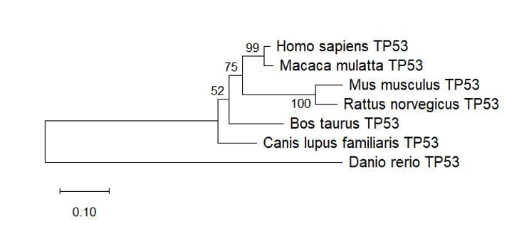
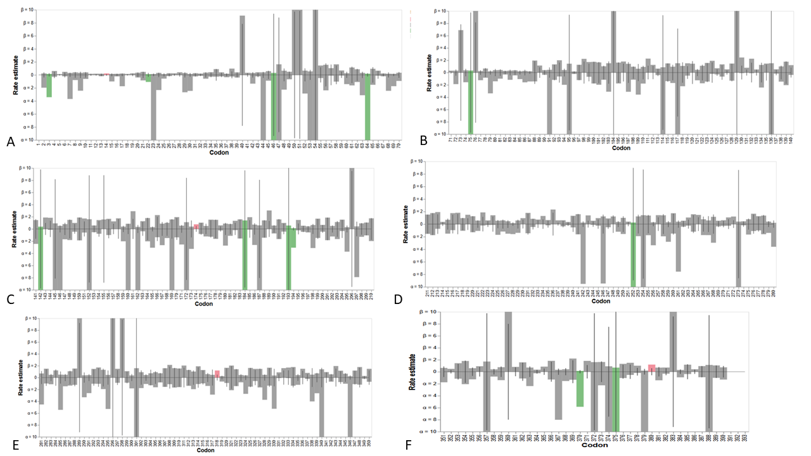

# Tracing the Pattern of Positive Selection and Structural Conservation in the Genome Guardian Gene (TP53) during Vertebrate Evolution

This repository contains the data, analysis settings, and results for an in-silico evolutionary study of the TP53 gene across seven vertebrate species.

## Project Overview
The TP53 gene, encoding the p53 protein, is known as the "Guardian of the Genome." This study investigates the evolutionary patterns of TP53 by analyzing:
- Pairwise genetic distances
- Phylogenetic relationships (Maximum Likelihood)
- Natural selection pressure at the codon level (FEL method)

## Study Species
- *Homo sapiens* (Human)
- *Macaca mulatta* (Rhesus macaque)
- *Mus musculus* (House mouse)
- *Rattus norvegicus* (Norway rat)
- *Bos taurus* (Cattle)
- *Canis lupus familiaris* (Dog)
- *Danio rerio* (Zebrafish) - Outgroup

## Methods
- **Sequence Retrieval:** NCBI database
- **Multiple Sequence Alignment (MSA):** MUSCLE algorithm (MEGA 12)
- **Genetic Distance:** Tamura-Nei (TN93) model (MEGA 12)
- **Phylogenetic Tree:** Maximum Likelihood (ML) with 1000 bootstrap replicates (MEGA 12)
- **Selection Pressure Analysis:** Fixed Effects Likelihood (FEL) on the Datamonkey server

## Key Results
- **Genetic Distance:** The lowest divergence was observed between *Homo sapiens* and *Macaca mulatta* (3.66%), while *Danio rerio* showed the greatest divergence from mammals (52.7% – 57.6%).
- **Phylogenetics:** High bootstrap support for primate (99%) and rodent (100%) clades. *Danio rerio* formed the basal outgroup.
- **Selection Analysis:** Out of 389 non-invariant codon sites, 12 sites were under purifying selection and 4 sites (codons 14, 174, 318, 380) showed evidence of positive/diversifying selection at p ≤ 0.05.

## Results Preview

### Phylogenetic Tree

### Selection Pressure Analysis (FEL)

### Codon Sites Under Selection
| Codon | α (Synonymous) | β (Nonsynonymous) | p-value | Selection Type |
|-------|-----------------|---------------------|---------|----------------|
| 3     | 3.427           | 0.142               | 0.0467  | Purifying      |
| 14    | 0.000           | 0.220               | 0.0462  | Diversifying   |
| 22    | 1.085           | 0.105               | 0.0283  | Purifying      |
| 46    | 405.238         | 0.305               | 0.0417  | Purifying      |
| 64    | 129.865         | 0.181               | 0.0393  | Purifying      |
| 75    | 390.662         | 0.328               | 0.0155  | Purifying      |
| 142   | 215.129         | 0.376               | 0.0272  | Purifying      |
| 174   | 0.000           | 0.756               | 0.0443  | Diversifying   |
| 184   | 1140.104        | 1.396               | 0.0449  | Purifying      |
| 193   | 10000.000       | 0.562               | 0.0235  | Purifying      |
| 194   | 3.078           | 0.102               | 0.0173  | Purifying      |
| 252   | 46.348          | 0.253               | 0.0205  | Purifying      |
| 318   | 0.000           | 1.192               | 0.0372  | Diversifying   |
| 370   | 5.851           | 0.134               | 0.0389  | Purifying      |
| 375   | 10000.000       | 0.687               | 0.0477  | Purifying      |
| 380   | 0.000           | 1.191               | 0.0185  | Diversifying   |

## Repository Structure
- `data/`: NCBI accession numbers and raw sequence information.
- `results/`: Output files including genetic distance matrix, phylogenetic tree, and FEL analysis plot.
- `docs/`: Full project report in Markdown format.

## Tools Used
- MEGA 12
- Datamonkey Server (FEL method)
- MUSCLE
- NCBI Database

## License
This project is licensed under the MIT License.
